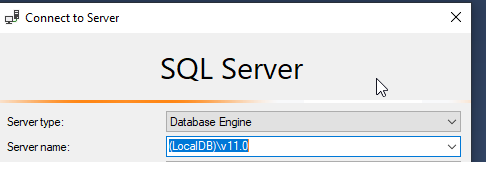
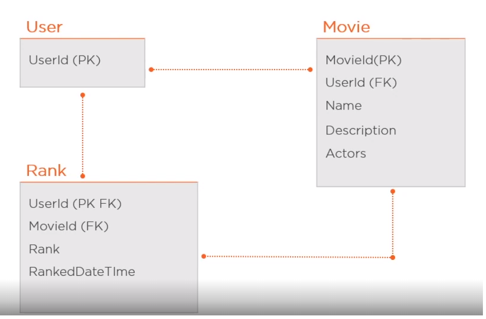

- [SSDT](#ssdt)
  - [How to add SqlCmdVariable in sqlproj file](#how-to-add-sqlcmdvariable-in-sqlproj-file)
  - [How to reference between *sqlproj* files](#how-to-reference-between-sqlproj-files)
    - [Publish order](#publish-order)
      - [Use *Include composite objects*](#use-include-composite-objects)
      - [Do not use *Include composite objects*](#do-not-use-include-composite-objects)
    - [Reference to dacpac](#reference-to-dacpac)
- [How to connect from SQL Mgmt Studio to localDB](#how-to-connect-from-sql-mgmt-studio-to-localdb)
- [Optimistic vs. Pessimistic Locking](#optimistic-vs-pessimistic-locking)
- [SQL vs No-SQL](#sql-vs-no-sql)
  - [Relational database model](#relational-database-model)
  - [No-sql database model](#no-sql-database-model)
- [SQL: Bitwise operators to store multiple values in one column](#sql-bitwise-operators-to-store-multiple-values-in-one-column)

# SSDT
## How to add SqlCmdVariable in sqlproj file
The following example shows how to add SqlCmdVariable that are set on values stored in Data-tier Application properties.   

```
  <ItemGroup>
    <SqlCmdVariable Include="SqlDacName">
      <DefaultValue>DefaultName</DefaultValue>
      <Value>$(Name)</Value>
    </SqlCmdVariable>
    <SqlCmdVariable Include="SqlDacVersion">
      <DefaultValue>DefaultVersion</DefaultValue>
      <Value>$(DacVersion)</Value>
    </SqlCmdVariable>
  </ItemGroup>
```

In this example two *sql cmd variables* are created: SqlDacName, SqlDacVersion. They are set on values taken from sqlproj properties:

```
<PropertyGroup>
    <Name>SSDT1</Name>
    <DacVersion>1.0.0.0</DacVersion>
    ...
</PropertyGroup>
```

Adding *sql cmd variables* causes that they will be displayed in publish dialog in Visual Studio. Click on *Load Values* will cause that
the variables will be set on values for the pointed sqlproj properties.   
Next the *sql cmd variables* can be use in sql files, for example:   

```
insert into [Schema1].[Versions] 
([Id], [DacName], [DacVersion], [DateTimeUtc], [Action])
values (1, N'$(SqlDacName)', N'$(SqlDacVersion)', GETUTCDATE(), N'PostDeploy');
```   

NOTE: the problem with *sql cmd variables* is that they have empty values in dacpac file, values from sqlproj properties are not preserved!.

model.xml (after extracing it from the dacpac file)
```
<CustomData Category="SqlCmdVariables" Type="SqlCmdVariable">
	<Metadata Name="SqlDacName" Value="" />
	<Metadata Name="SqlDacVersion" Value="" />
</CustomData>
```

## How to reference between *sqlproj* files
In order to reference one *sqlproj* in another *sqlproj* a *database reference* has to be added.   

### Publish order

#### Use *Include composite objects*

Option *Include composite objects* is set in publish file **.publish.xml*. By default it is enabled.


In case SSDT2 has reference to SSDT1 then publish of SSDT2 first will execute publish of SSDT1. The mechanism checks reference tree. Publication on root *sqlproj* will start publish from the leaves *sqlprojs* up to the root *sqlproj*.   

NOTE: there is one **drawback** in this mechanism. **Pre-deployment and pos-deployment scripts from the referenced projects are not executed!**.
Workaround is to reference them in the pre-deployment and pos-deployment directly using *:r* syntax.

```
:r ..\..\SSDT1\Scripts\Script.PreDeployment.sql
```   
The path starts from the file in which *:r* is used.
To avoid misleadining errors in VS *SQLCMD* mode has to be enabled.


#### Do not use *Include composite objects*

In case this option is not used then all *sqlprojs* has to be executed explicitly in proper order.   

NOTE: *Without this option set the source project will be deployed without the referenced projects or dacpacs.  If you deploy to an existing database and forget to set this option but have set options to delete objects in the target that are not in the source, you risk deleting important content from the database.  Schema Compare will highlight such delete actions very clearly, but it will be less obvious in Publish and will happen silently in Debug/Deploy.  Be careful!* [more here](https://blogs.msdn.microsoft.com/ssdt/2012/06/26/composite-projects-and-schema-compare/)

### Reference to dacpac
*SSDT3refToDacpac.sqlproj* shows to reference *dacpac* file.
*Dacpac* file is output of *sqlproj* compilation.

NOTE: in case of referencing *dacpacs* there is no easy workaround for issue with not executing pre-deployment and post-deployment scripts from the referenced *dacpacs* in case of using option *Include composite objects*.   

One possibility is to unzip referenced *dacpacs* and copy their pre-deployment and post-deployment script to some folder in the *sqlproj* that is on the top (root). Next they can be referenced using option *:r* in the root *sqlproj*.   

Another way is to **do not use** *Include composite objects* option and run every *sqlproj*/*dacpac* individually. In this case it is wise to take care that all *sqlproj*/*dacpac* will be executed in one transaction so in case of some errors the whole published will be rolled-back and there will not be a need to restore database from backup files.

# How to connect from SQL Mgmt Studio to localDB

In ```Server name``` input type: (LocalDB)\v11.0, (LocalDB)\.  (if ended by dot it will connect to default localDB)



# Optimistic vs. Pessimistic Locking

[Optimistic vs. Pessimistic Locking](https://recepinanc.medium.com/til-9-optimistic-vs-pessimistic-locking-79a349b76dc8#:~:text=Optimistic%20Locking%20is%20when%20you,can%20start%20modifying%20the%20record.)

[Sql Server example](https://blog.greglow.com/2018/09/24/sql-implementing-optimistic-concurrency-in-sql-server-with-rowversion/)

>"Optimistic Locking is when you check if the record was updated by someone else before you commit the transaction."

>"Pessimistic locking is when you take an exclusive lock so that no one else can start modifying the record."

[example - transaction1](./SQL%20Server/005_OptymisticLock.sql)   
[example - transaction2](./SQL%20Server/../SQL%20Server/005_OptymisticLockSecondTrans.sql)


# SQL vs No-SQL

Pros of a Relational Database (SQL)
1. Data is easily structured into categories (predefined schema).
2. Your data is consistent in input, meaning, and easy to navigate.
3. Relationships can be easily defined between data points.
4. SQL databases are vertically scalable.
5. SQL databases are not suitable for hierarchical data storage.
6. Specialized DB hardware (Oracle Exadata, etc.)
7. Highly Available Storage (SAN, RAID, etc.)

Pros of a Non-Relational Database (NoSQL)
1. Data is not confined to a structured group (dynamic schema driven by data).
2. You can perform functions that allow for greater flexibility.
3. Your data and analysis can be more dynamic and allow for more variant inputs.
4. NoSQL databases are horizontally scalable (scale out).
5. ACID NOT always guaranteed. Use when it's more important to have fast data than correct data. Base ( Basically Available, Soft state, Eventually Consistent) is a model of many NoSQL systems.
6. Suit more for those who handles huge volumes of data
7. More suitable for the hierarchical data store as it supports key-value pair method.
8. Commodity hardware
9. Commodity drives storage (standard HDDs, JBOD)

Types of NoSQL databases:
* column-oriented
* document-oriented (similar to key-value but value can be a structure for example json)
* graph-based
* key-value store

The Scalability
>"In most situations, SQL databases are vertically scalable, which means that you can increase the load on a single server by increasing things like CPU, RAM or SSD. NoSQL databases, on the other hand, are horizontally scalable. This means that you handle more traffic by sharding, or adding more servers in your NoSQL database."

## Relational database model



## No-sql database model


https://aloa.co/blog/relational-vs-non-relational-database-pros-cons   
https://www.xplenty.com/blog/the-sql-vs-nosql-difference   
https://www.guru99.com/sql-vs-nosql.html

# SQL: Bitwise operators to store multiple values in one column

[bitwise.sql](./SQL%20Server/Bitwise.sql)

https://www.mssqltips.com/sqlservertip/1218/sql-server-bitwise-operators-to-store-multiple-values-in-one-column/   
