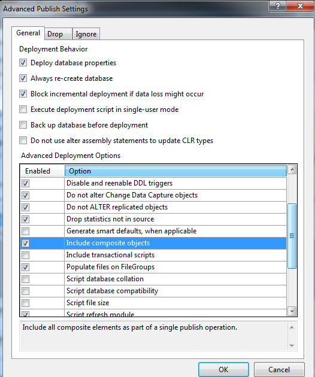
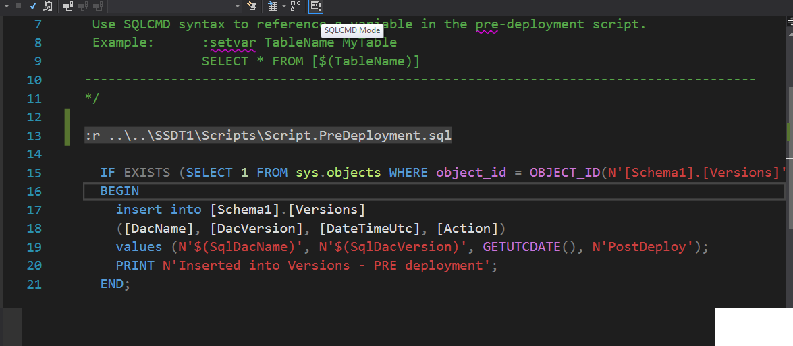

# sql
sql examples

## SSDT
### How to add SqlCmdVariable in sqlproj file
The following example shows how to add SqlCmdVariable that are set on values stored in Data-tier Application properties.   

```
  <ItemGroup>
    <SqlCmdVariable Include="SqlDacName">
      <DefaultValue>DefaultName</DefaultValue>
      <Value>$(Name)</Value>
    </SqlCmdVariable>
    <SqlCmdVariable Include="SqlDacVersion">
      <DefaultValue>DefaultVersion</DefaultValue>
      <Value>$(DacVersion)</Value>
    </SqlCmdVariable>
  </ItemGroup>
```

In this example two *sql cmd variables* are created: SqlDacName, SqlDacVersion. They are set on values taken from sqlproj properties:

```
<PropertyGroup>
    <Name>SSDT1</Name>
    <DacVersion>1.0.0.0</DacVersion>
    ...
</PropertyGroup>
```

Adding *sql cmd variables* causes that they will be displayed in publish dialog in Visual Studio. Click on *Load Values* will cause that
the variables will be set on values for the pointed sqlproj properties.   
Next the *sql cmd variables* can be use in sql files, for example:   

```
insert into [Schema1].[Versions] 
([Id], [DacName], [DacVersion], [DateTimeUtc], [Action])
values (1, N'$(SqlDacName)', N'$(SqlDacVersion)', GETUTCDATE(), N'PostDeploy');
```   
### How to reference between *sqlproj* files
In order to reference one *sqlproj* in another *sqlproj* a *database reference* has to be added.   

#### Publish order

##### Use *Include composite objects*

Option *Include composite objects* is set in publish file **.publish.xml*. By default it is enabled.



In case SSDT2 has reference to SSDT1 then publish of SSDT2 first will execute publish of SSDT1. The mechanism checks reference tree. Publication on root *sqlproj* will start publish from the leaves *sqlprojs* up to the root *sqlproj*.   

NOTE: there is one drawback in this mechanism. Pre-deployment and pos-deployment scripts from the referenced projects are not executed!.
Workaround is to reference them in the pre-deployment and pos-deployment directly using *:r* syntax.

```
:r ..\..\SSDT1\Scripts\Script.PreDeployment.sql
```   
The path starts from the file in which *:r* is used.
To avoid misleadining errors in VS *SQLCMD* mode has to be enabled.



##### Do not use *Include composite objects*

In case this option is not used then all *sqlprojs* has to be executed explicitly in proper order.   

NOTE: *Without this option set the source project will be deployed without the referenced projects or dacpacs.  If you deploy to an existing database and forget to set this option but have set options to delete objects in the target that are not in the source, you risk deleting important content from the database.  Schema Compare will highlight such delete actions very clearly, but it will be less obvious in Publish and will happen silently in Debug/Deploy.  Be careful!* [more here](https://blogs.msdn.microsoft.com/ssdt/2012/06/26/composite-projects-and-schema-compare/)

#### Reference to dacpac
*SSDT3refToDacpac.sqlproj* shows to reference *dacpac* file.
*Dacpac* file is out of *sqlproj* compilation.

NOTE: in case of referencing *dacpacs* there is no easy workaround for issue with not executing pre-deployment and post-deployment scripts from the referenced *dacpacs*. One possibility is to unzip referenced *dacpacs* and copy their pre-deployment and post-deployment script to some folder in the *sqlproj* that is on the top (root). Next they can be referenced using option *:r* in the root *sqlproj*.